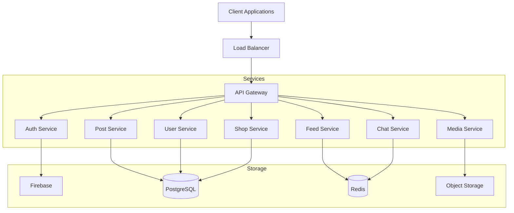
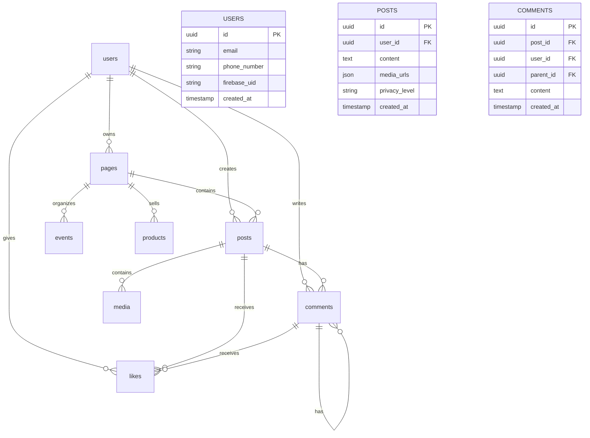
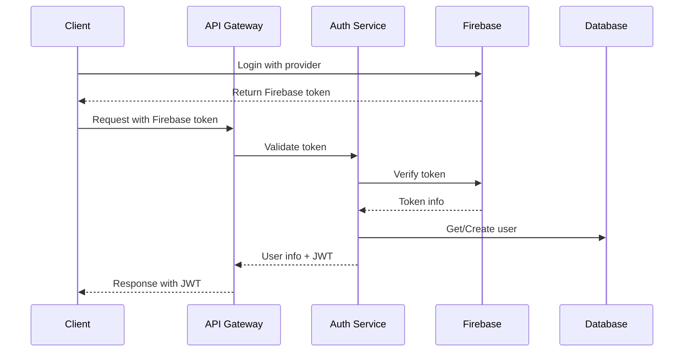
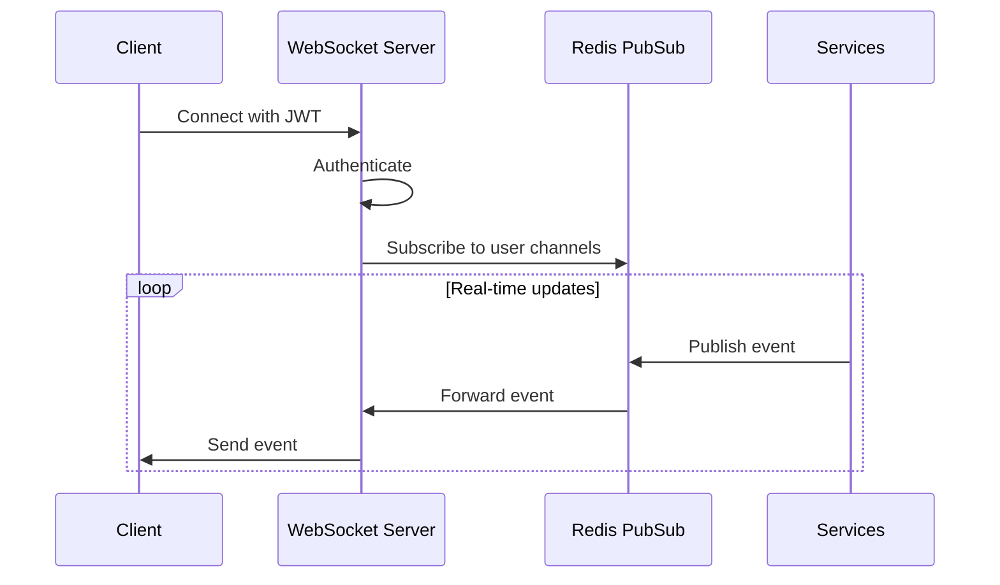
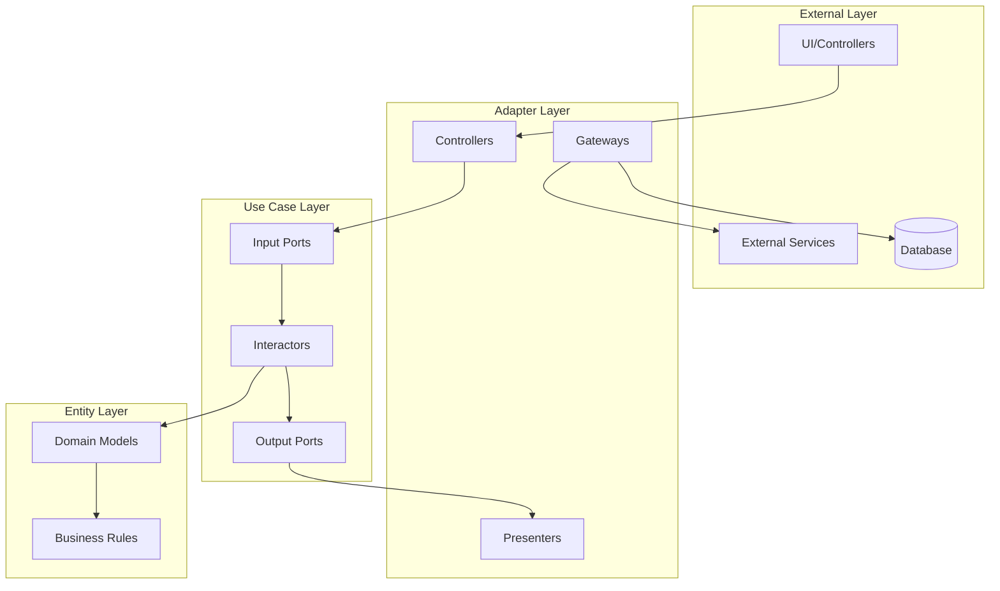
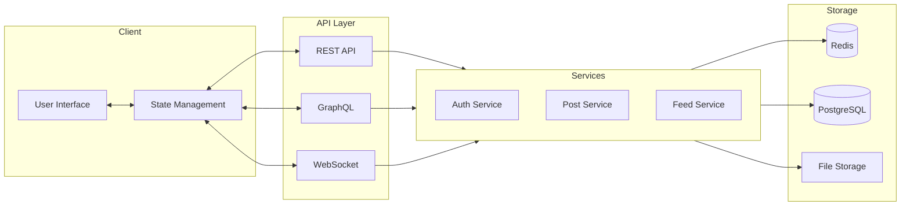
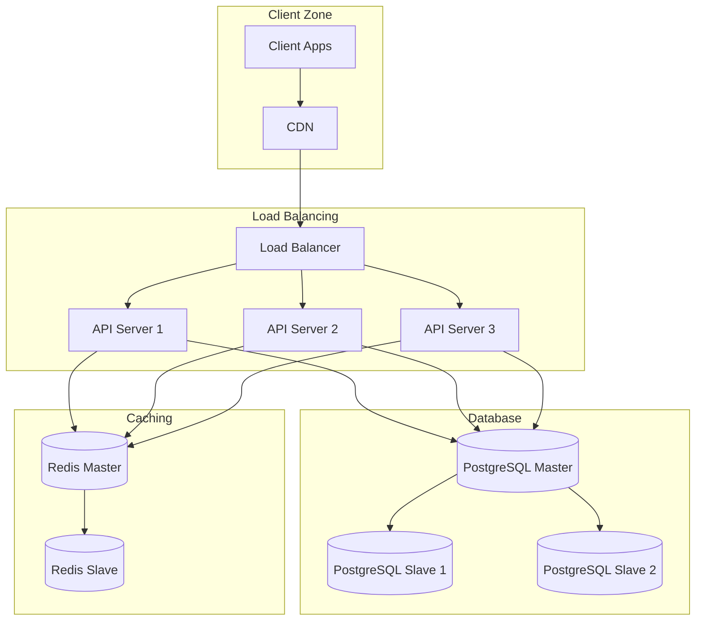
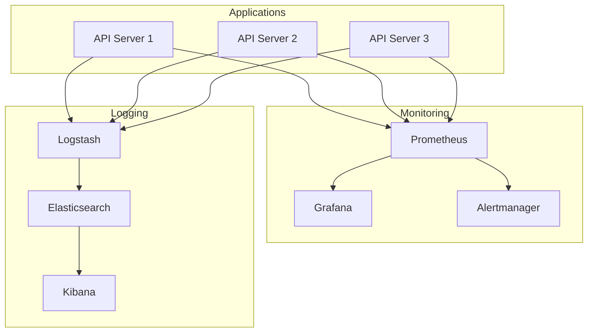
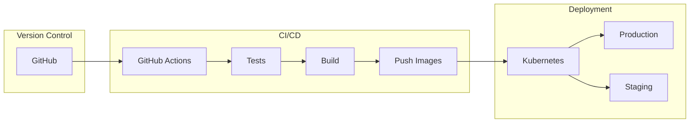

# Architecture Diagrams

## System Architecture

## Database Schema

## Authentication Flow

## Real-time Communication

## Clean Architecture

## Data Flow

## Deployment Architecture

## Monitoring Setup

## CI/CD Pipeline

